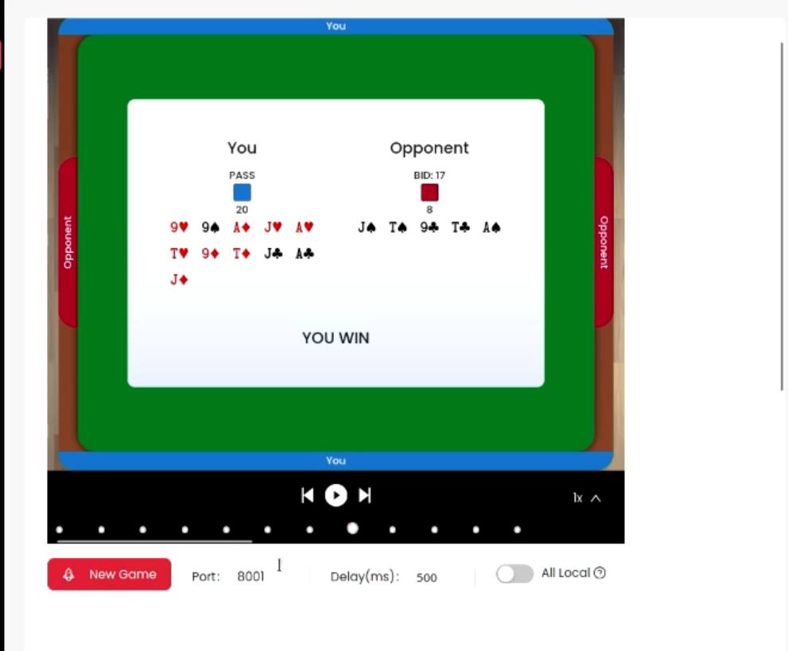

# DumbBot@Dev2079
###
This is a smartbot kinda dumb though..which plays 29-card-game autonomously. This bot is made in RUST from scratch. I made the 29-card-game using 2 methods, one by using hardcore method and another using MCTS method. I haven't fully implemented MCTS. But I have implemented the concept of MCTS in RUST. I was learning RUST at that time, I spend most of the time learning RUST. My achievement was, I have won 500+ games out of 1000 while playing with organizer's smart bot.
###
## Here is a simple demo.
 

